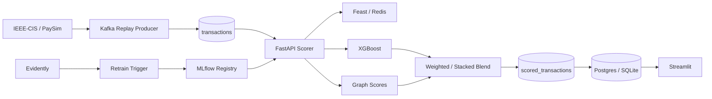

# Architecture

```mermaid
flowchart LR
  CSV[IEEE-CIS / PaySim] --> Replay[Kafka Replay Producer]
  Replay --> Kafka[(transactions)]
  Kafka --> API[FastAPI Scorer]
  API --> Feast[Feast / Redis]
  API --> XGB[XGBoost]
  API --> GNN[Graph Scores]
  XGB --> Blend[Weighted / Stacked Blend]
  GNN --> Blend
  Blend --> Scored[(scored_transactions)]
  Scored --> DB[(Postgres / SQLite)]
  DB --> Dashboard[Streamlit]
  Evidently[Evidently] --> Retrain[Retrain Trigger]
  Retrain --> MLflow[MLflow Registry]
  MLflow --> API
```
